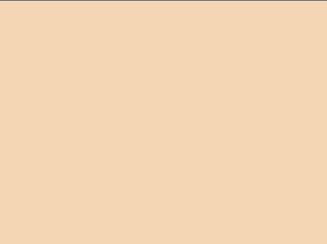
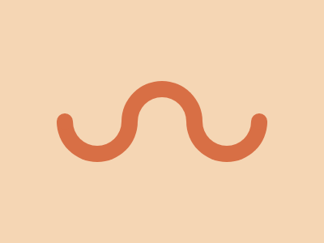

# #12. Wiggly Moustache

Challenge: <https://cssbattle.dev/play/12>

## Result

<table>
	<tr>
		<th width="50%">User Submission</th>
		<th width="50%">Target</th>
	</tr>
	<tr>
		<td width="50%" align="center">
			
		</td>
		<td width="50%" align="center">
			
		</td>
	</tr>
</table>

## Code

```html
<div></div>
<style>
  & {
    width: 100px;
    height: 100px;
    background: #F5D6B4;
  }
</style>
```
