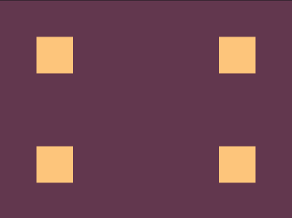

# #2. Carrom

Challenge: <https://cssbattle.dev/play/2>

## Result

<table>
	<tr>
		<th width="50%">User Submission</th>
		<th width="50%">Target</th>
	</tr>
	<tr>
		<td width="50%" align="center">
			
		</td>
		<td width="50%" align="center">
			
		</td>
	</tr>
</table>

## Code

```html
<div></div>
<div></div>
<style>
  body {
    margin: 0;
    background: #62374e;
  }
  div {
    width: 50px;
    height: 50px;
    background: #fdc57b;
    margin: 50px 50px 100px;
    box-shadow: 250px 0 #fdc57b;
  }
</style>
```

## Submission Data

- Challenge: #2. Carrom
- Score: 645.97
- Match: 100%
- Submitted at: 2026-06-04T17:46:22.177Z
