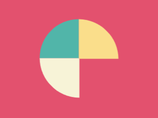

# #6. Missing Slice

Challenge: <https://cssbattle.dev/play/6>

## Result

<table>
	<tr>
		<th width="50%">User Submission</th>
		<th width="50%">Target</th>
	</tr>
	<tr>
		<td width="50%" align="center">
			
		</td>
		<td width="50%" align="center">
			
		</td>
	</tr>
</table>

## Code

```html
<div></div>
<style>
  body{
    background: #E3516E;
    margin: 50px 100px;
  }
  div{
    border: 100px solid;
    border-radius: 50%;
    border-color: #FADE8B transparent #F7F3D7 #51B5A9;
    transform: rotate(45deg);
  }
</style>
```
