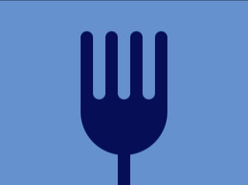
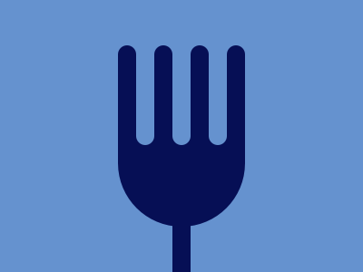

# #8. Forking Crazy

Challenge: <https://cssbattle.dev/play/8>

## Result

<table>
	<tr>
		<th width="50%">User Submission</th>
		<th width="50%">Target</th>
	</tr>
	<tr>
		<td width="50%" align="center">
			
		</td>
		<td width="50%" align="center">
			
		</td>
	</tr>
</table>

## Code

```html
<p><p i><p i r><style>&{background:#6592cf}p{position:fixed;background:#060f55;height:100;width:140;border-radius:0 0 5pc 5pc;top:134;left:130}[i]{height:110;width:20;border-radius:5vw 5vw 0 0;box-shadow:5ch 0#060f55,5pc 0#060f55,30vw 0#060f55,60px 50vh#060f55;top:34}[r]{transform:scaleY(-1);background:#6592cf;box-shadow:5ch 0#6592cf,5pc 0#6592cf,30vw 0#6592cf;left:150
```
