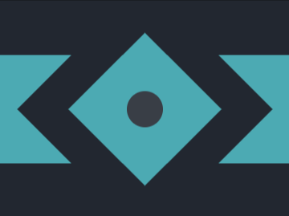

# #9. Tesseract

Challenge: <https://cssbattle.dev/play/9>

## Result

<table>
	<tr>
		<th width="50%">User Submission</th>
		<th width="50%">Target</th>
	</tr>
	<tr>
		<td width="50%" align="center">
			
		</td>
		<td width="50%" align="center">
			
		</td>
	</tr>
</table>

## Code

```html
<p r><p s><p c><style>body{background:#222730;margin:0}p{position:absolute;height:150;background:#4caab3}[r]{width:400;margin:75 0}[s]{width:150;transform:rotate(45deg);outline:50px solid#222730;margin:75 125}[c]{background:#393e46;width:50;height:50;border-radius:50%;margin:125 175
```
