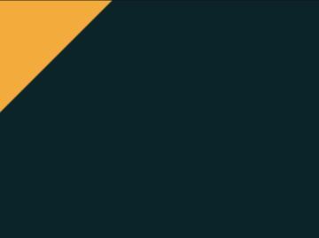

# #13. Totally Triangle

Challenge: <https://cssbattle.dev/play/13>

## Result

<table>
	<tr>
		<th width="50%">User Submission</th>
		<th width="50%">Target</th>
	</tr>
	<tr>
		<td width="50%" align="center">
			
		</td>
		<td width="50%" align="center">
			
		</td>
	</tr>
</table>

## Code

```html
<style>&{background:#0b2429;margin:-150;*{background:#f3ac3c;rotate:45deg;height:488;width:150
```
