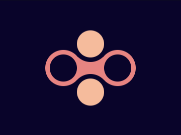
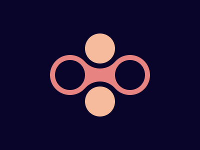

# #17. Fidget Spinner

Challenge: <https://cssbattle.dev/play/17>

## Result

<table>
	<tr>
		<th width="50%">User Submission</th>
		<th width="50%">Target</th>
	</tr>
	<tr>
		<td width="50%" align="center">
			
		</td>
		<td width="50%" align="center">
			
		</td>
	</tr>
</table>

## Code

```html
<div class="mid"></div><div class="circle small n"></div><div class="circle small s"></div><div class="circle small o"></div><div class="circle small w"></div>
<style>
body {
  background: #09042a;
  display: flex;
  align-items: center;
  justify-content: center;
}
div {
  position: absolute;
}
.circle {
  border-radius: 50%;
}
.small {
  width: 60px;
  height: 60px;
}
.n,
.s {
  background: #f5bb9c;
  border: 10px solid #09042a;
}
.n {
  top: 57px;
}
.s {
  bottom: 57px;
}
.o,
.w {
  background: #09042a;
  border: 10px solid #e78481;
```
