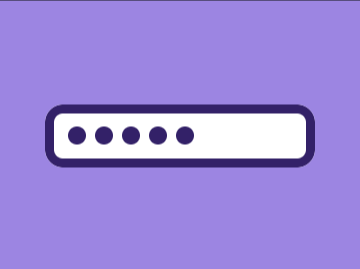
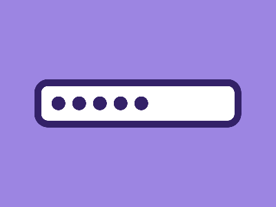

# Daily Target — Jun 5, 2026

Challenge: <https://cssbattle.dev/play/IgyOIJdxXjX2em7d88fk>

## Result

<table>
	<tr>
		<th width="50%">User Submission</th>
		<th width="50%">Target</th>
	</tr>
	<tr>
		<td width="50%" align="center">
			
		</td>
		<td width="50%" align="center">
			
		</td>
	</tr>
</table>

## Code

```html
<div></div>
<div></div>
<div></div>
<div></div>
<div></div>
<style>
  body {
    background: #FFFFFF;
    border: 10px solid #332168;
    outline: 2in solid #9C85E2;
    border-radius: 20px;
    margin: 115px 50px;
    display: flex;
    align-items: center;
    gap: 10px;
    padding: 15px;
    div {
      border: 10px solid #332168;
      border-radius: 50%;
    }
  }
</style>
```
