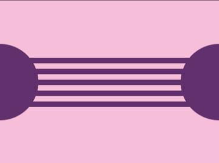

# Daily Target — Jun 30, 2026

Challenge: <https://cssbattle.dev/play/3bZZVPZQWMXqq8yg75W5>

## Result

<table>
	<tr>
		<th width="50%">User Submission</th>
		<th width="50%">Target</th>
	</tr>
	<tr>
		<td width="50%" align="center">
			
		</td>
		<td width="50%" align="center">
			
		</td>
	</tr>
</table>

## Code

```html
<style>
& {
  background:
    repeating-linear-gradient(#62306d 0 10px, #f7bed9 10px 20px) 0 105px / 100%
      90px no-repeat,
    #f7bed9;
  * {
    background: #62306d;
    border-radius: 50%;
    width: 140;
    height: 140;
    margin: 80 -70;
    box-shadow: 400px 0 #62306d;
  }
}
</style>
```
