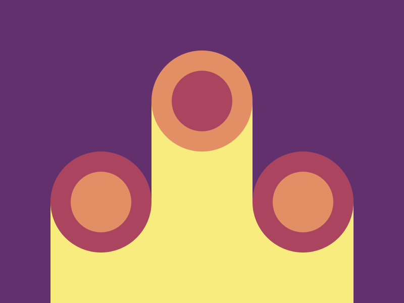

# Target 10: Cloaked Spirits

Challenge: <https://cssbattle.dev/play/10>

## Result

<table>
	<tr>
		<th width="50%">User Submission</th>
		<th width="50%">Target</th>
	</tr>
	<tr>
		<td width="50%" align="center">
			Not available
		</td>
		<td width="50%" align="center">
			
		</td>
	</tr>
</table>

## Code

```html
<div class="wrapper r">
  <div></div>
  <div class="rect"></div>
  <div></div>
  <div class="rect"></div>
  <div class="rect"></div>
  <div class="rect"></div>
</div>
<div class="wrapper c">
  <div></div>
  <div class="circle inverted"></div>
  <div></div>
  <div class="circle"></div>
  <div></div>
  <div class="circle"></div>
</div>
<style>
  body {
    background: #62306D;
    margin: 0;
  }
  .wrapper{
    display: grid;
    position: absolute;
    grid-template-columns: repeat(3, 100px);
    grid-template-rows: repeat(2, 100px);
  }
  .r {
    margin: 100px 50px;
  }
  .c {
    margin: 50px;
  }
  .rect {
    background: #F7EC7D;
  }
  .circle {
    width: 60px;
    height: 60px;
    background: #E38F66;
    border-radius: 50%;
    border: 20px solid #AA445F;
  }
  .inverted {
    background: #AA445F !important;
    border-color: #E38F66 !important;
  }
</style>
```

## Submission Data

- Challenge: Target 10: Cloaked Spirits
- Score: 600.09
- Match: 100%
- Submitted at: 2026-05-20T17:10:20.326Z
