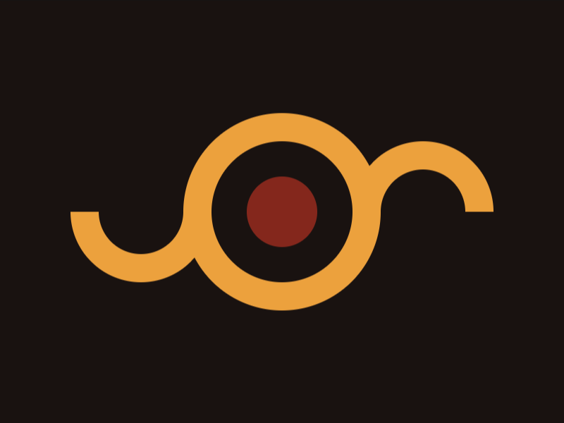
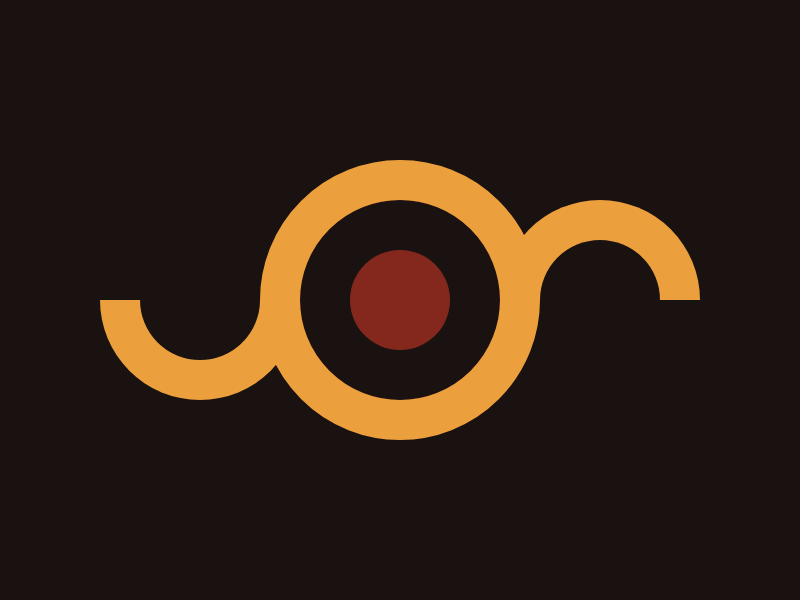

# Target 11: Eye of Sauron

Challenge: <https://cssbattle.dev/play/11>

## Result

<table>
	<tr>
		<th width="50%">User Submission</th>
		<th width="50%">Target</th>
	</tr>
	<tr>
		<td width="50%" align="center">
			
		</td>
		<td width="50%" align="center">
			
		</td>
	</tr>
</table>

## Code

```html
<div class="circle"></div>
<div class="semi"></div>
<div class="semi inverted"></div>
<style>
  body {
    background: #191210;
    margin: 0;
  }
  div {
    position: absolute;
  }
  .circle {
    width: 50px;
    height: 50px;
    background: #84271C;
    border-radius: 50%;
    border: 25px solid #191210;
    outline: 20px solid #ECA03D;
    margin: 100px 150px;
  }
  .semi {
    width: 60px;
    height: 30px;
    border-radius: 0 0 80px 80px;
    border: 20px solid #ECA03D;
    border-top: 0;
    margin: 150px 50px;
  }
  .inverted {
    transform: rotate(180deg) translate(-200px, 50px);
```

## Submission Data

- Challenge: Target 11: Eye of Sauron
- Score: 601.13
- Match: 100%
- Submitted at: 2026-05-20T16:58:48.645Z
