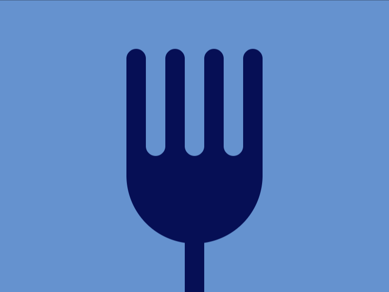
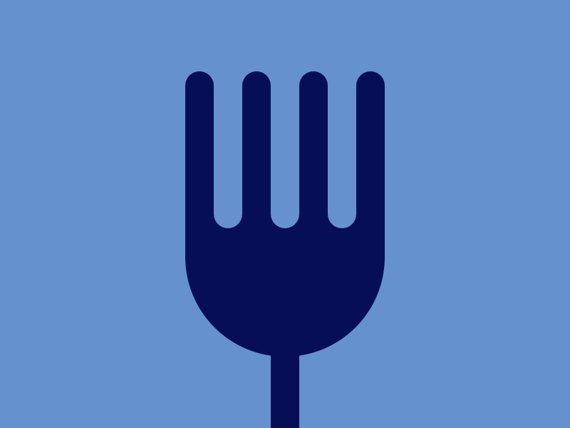

# Target 8: Forking Crazy

Challenge: <https://cssbattle.dev/play/8>

## Result

<table>
	<tr>
		<th width="50%">User Submission</th>
		<th width="50%">Target</th>
	</tr>
	<tr>
		<td width="50%" align="center">
			
		</td>
		<td width="50%" align="center">
			
		</td>
	</tr>
</table>

## Code

```html
<div class="bot"></div>
<div class="rect"></div>
<div class="wrapper">
  <div class="inner"></div>
  <div class="inner reverse"></div>
  <div class="inner"></div>
  <div class="inner reverse"></div>
  <div class="inner"></div>
  <div class="inner reverse"></div>
  <div class="inner"></div>
</div>
<style>
  body {
    background: #6592CF;
    display: flex;
    align-items: center;
    justify-content: center;
  }
  div:not(.wrapper):not(.reverse) {
    background: #060F55;
  }
  div:not(.inner):not(.reverse) {
    position: absolute;
  }
  .wrapper {
    display: flex;
    bottom: 140px;
  }
  .inner {
    height: 110px;
    width: 20px;
    border-radius: 20px 20px 0 0;
  }
  .reverse {
    transform: scaleY(-1);
    background: #6592CF;
  }
  .bot {
    height: 100px;
    width: 140px;
    border-radius: 0 0 80px 80px;
    bottom: 50px;
  }
  .rect {
    height: 60px;
    width: 20px;
    bottom: 0;
  }
</style>
```

## Submission Data

- Challenge: Target 8: Forking Crazy
- Score: 600.06
- Match: 100%
- Submitted at: 2026-05-20T16:52:50.338Z
