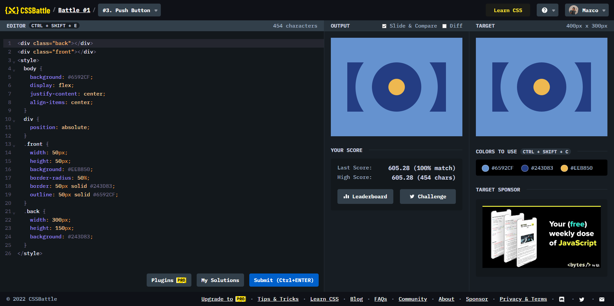

# Battle #1 - Pilot Battle

## #3 - Push Button

[Link to the problem](https://cssbattle.dev/play/3)



```html
<div class="back"></div>
<div class="front"></div>
<style>
  body {
    background: #6592CF;
    display: flex;
    justify-content: center;
    align-items: center;
  }
  div {
    position: absolute;
  }
  .front {
    width: 50px;
    height: 50px;
    background: #EEB850;
    border-radius: 50%;
    border: 50px solid #243D83;
    outline: 50px solid #6592CF;
  }
  .back {
    width: 300px;
    height: 150px;
    background: #243D83;
  }
</style>
```
