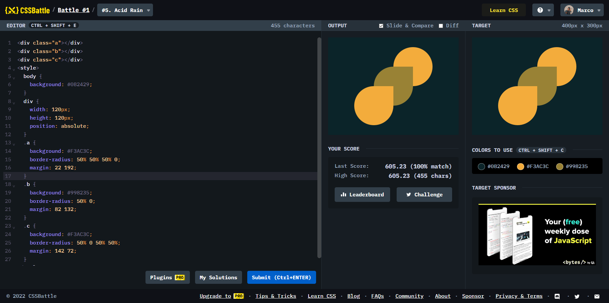

# Battle #1 - Pilot Battle

## #5 - Acid Rain

[Link to the problem](https://cssbattle.dev/play/5)



```html
<div class="a"></div>
<div class="b"></div>
<div class="c"></div>
<style>
  body {
    background: #0B2429;
  }
  div {
    width: 120px;
    height: 120px;
    position: absolute;
  }
  .a {
    background: #F3AC3C;
    border-radius: 50% 50% 50% 0;
    margin: 22 192;
  }
  .b {
    background: #998235;
    border-radius: 50% 0;
    margin: 82 132;
  }
  .c {
    background: #F3AC3C;
    border-radius: 50% 0 50% 50%;
    margin: 142 72;
  }
</style>
```
