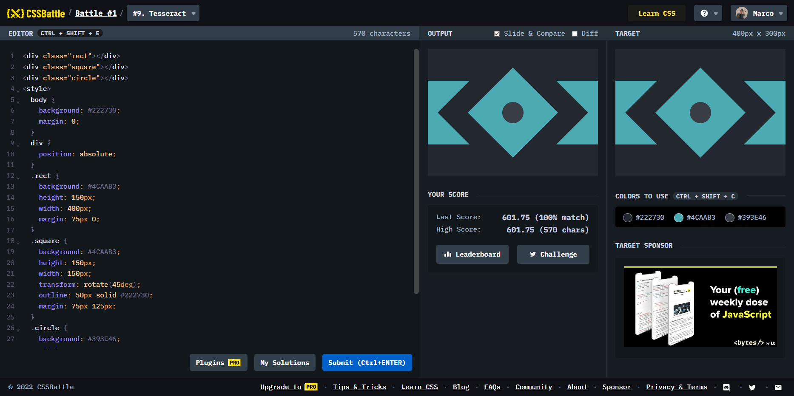

# Battle #1 - Pilot Battle

## #9 - Tesseract

[Link to the problem](https://cssbattle.dev/play/9)



```html
<div class="rect"></div>
<div class="square"></div>
<div class="circle"></div>
<style>
  body {
    background: #222730;
    margin: 0;
  }
  div {
    position: absolute;
  }
  .rect {
    background: #4CAAB3;
    height: 150px;
    width: 400px;
    margin: 75px 0;
  }
  .square {
    background: #4CAAB3;
    height: 150px;
    width: 150px;
    transform: rotate(45deg);
    outline: 50px solid #222730;
    margin: 75px 125px;
  }
  .circle {
    background: #393E46;
    width: 50px;
    height: 50px;
    border-radius: 50%;
    margin: 125px 175px;
  }
</style>
```
