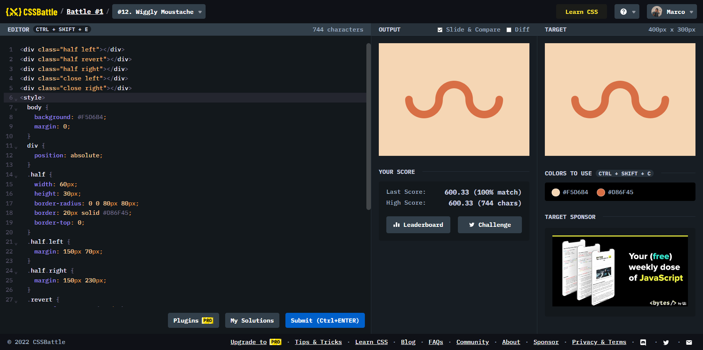

# Battle #1 - Pilot Battle

## #12 - Wiggly Moustache

[Link to the problem](https://cssbattle.dev/play/12)



```html
<div class="half left"></div>
<div class="half revert"></div>
<div class="half right"></div>
<div class="close left"></div>
<div class="close right"></div>
<style>
  body {
    background: #F5D6B4;
    margin: 0;
  }
  div {
    position: absolute;
  }
  .half {
    width: 60px;
    height: 30px;
    border-radius: 0 0 80px 80px;
    border: 20px solid #D86F45;
    border-top: 0;
  }
  .half.left {
    margin: 150px 70px;
  }
  .half.right {
    margin: 150px 230px;
  }
  .revert {
    transform: rotate(180deg);
    margin: 100px 150px;
  }
  .close {
    background: #D86F45;
    width: 20px;
    height: 20px;
    border-radius: 50%;
  }
  .close.left {
    margin: 140px 70px;
  }
  .close.right {
    margin: 140px 310px;
  }
</style>
```
