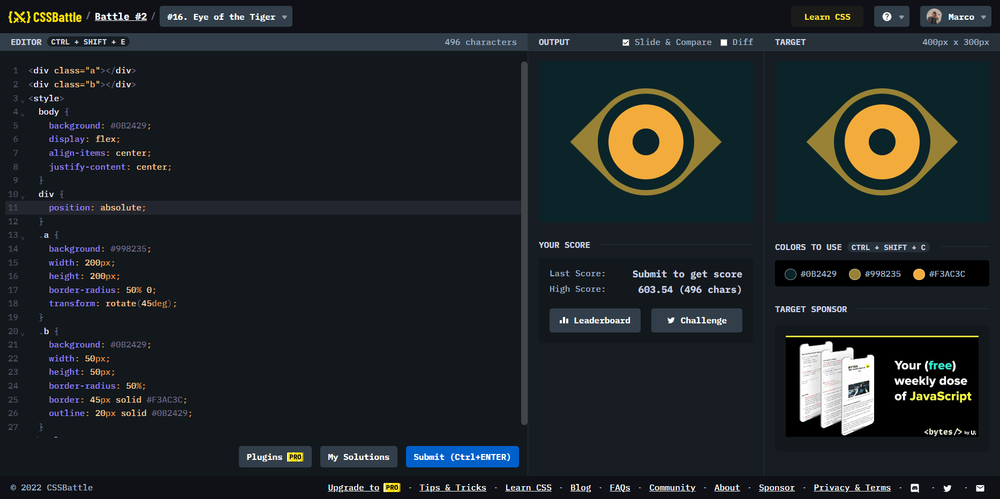

# Battle #2 - Visibility

## #16 - Eye of the Tiger

[Link to the problem](https://cssbattle.dev/play/16)



```html
<div class="a"></div>
<div class="b"></div>
<style>
  body {
    background: #0B2429;
    display: flex;
    align-items: center;
    justify-content: center;
  }
  div {
    position: absolute;
  }
  .a {
    background: #998235;
    width: 200px;
    height: 200px;
    border-radius: 50% 0;
    transform: rotate(45deg);
  }
  .b {
    background: #0B2429;
    width: 50px;
    height: 50px;
    border-radius: 50%;
    border: 45px solid #F3AC3C;
    outline: 20px solid #0B2429;
  }
</style>
```
