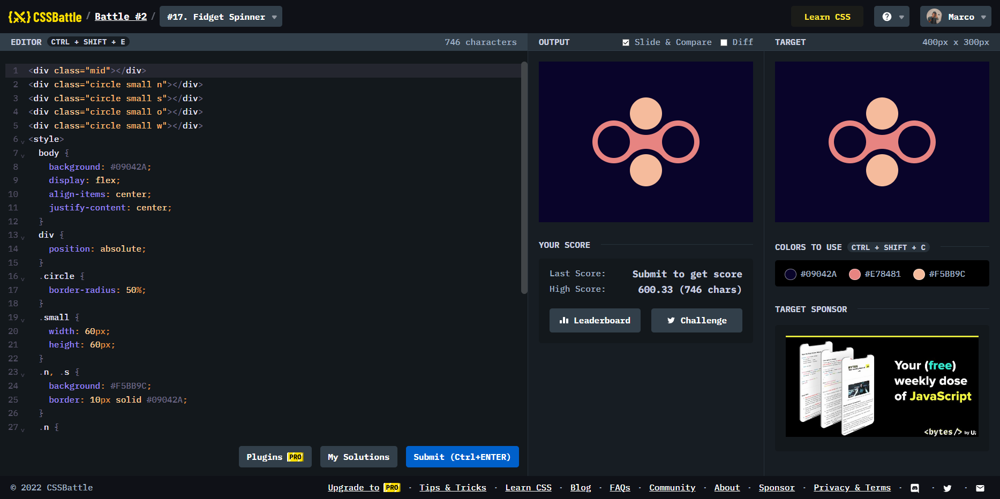

# Battle #2 - Visibility

## #17 - Fidget Spinner

[Link to the problem](https://cssbattle.dev/play/17)



```html
<div class="mid"></div>
<div class="circle small n"></div>
<div class="circle small s"></div>
<div class="circle small o"></div>
<div class="circle small w"></div>
<style>
  body {
    background: #09042A;
    display: flex;
    align-items: center;
    justify-content: center;
  }
  div {
    position: absolute;
  }
  .circle {
    border-radius: 50%;
  }
  .small {
    width: 60px;
    height: 60px;
  }
  .n, .s {
    background: #F5BB9C;
    border: 10px solid #09042A;
  }
  .n {
    top: 57px;
  }
  .s {
    bottom: 57px;
  }
  .o, .w {
    background: #09042A;
    border: 10px solid #E78481;
  }
  .o {
    left: 100px;
  }
  .w {
    right: 100px;
  }
  .mid {
    background: #E78481;
    width: 70px;
    height: 50px;
  }
</style>
```
