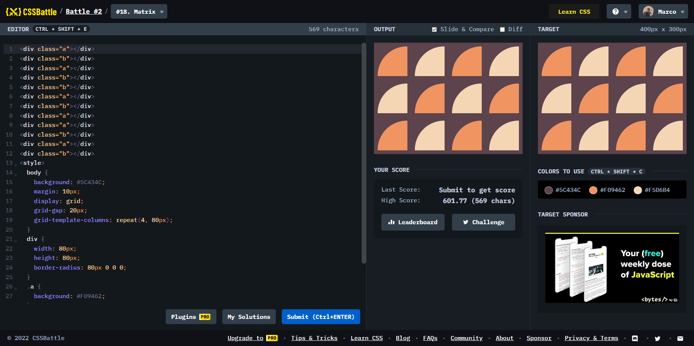

# Battle #2 - Visibility

## #18 - Matrix

[Link to the problem](https://cssbattle.dev/play/18)



```html
<div class="a"></div>
<div class="b"></div>
<div class="a"></div>
<div class="b"></div>
<div class="b"></div>
<div class="a"></div>
<div class="b"></div>
<div class="a"></div>
<div class="a"></div>
<div class="b"></div>
<div class="a"></div>
<div class="b"></div>
<style>
  body {
    background: #5C434C;
    margin: 10px;
    display: grid;
    grid-gap: 20px;
    grid-template-columns: repeat(4, 80px);
  }
  div {
    width: 80px;
    height: 80px;
    border-radius: 80px 0 0 0;
  }
  .a {
    background: #F09462;
  }
  .b {
    background: #F5D6B4;
  }
</style>
```
