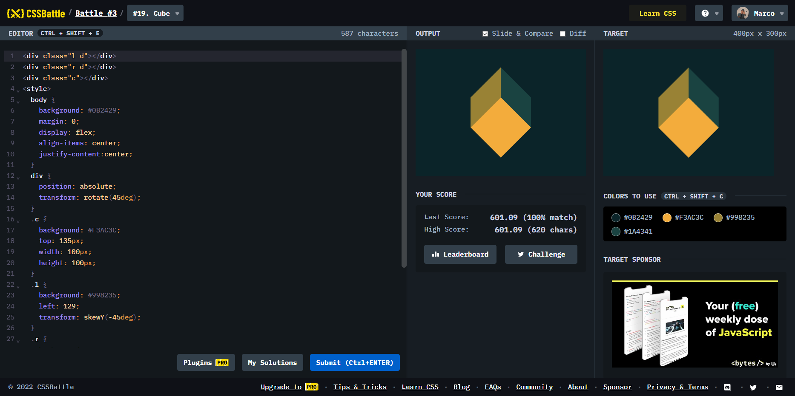

# Battle #3 - Cursor

## #19 - Cube

[Link to the problem](https://cssbattle.dev/play/19)



```html
<div class="l d"></div>
<div class="r d"></div>
<div class="c"></div>
<style>
  body {
    background: #0B2429;
    margin: 0;
    display: flex;
    align-items: center;
    justify-content:center;
  }
  div {
    position: absolute;
    transform: rotate(45deg);
  }
  .c {
    background: #F3AC3C;
    top: 135px;
    width: 100px;
    height: 100px;
  }
  .l {
    background: #998235;
    left: 129;
    transform: skewY(-45deg);
  }
  .r {
    background: #1A4341;
    right: 129;
    transform: skewY(45deg);
  }
  .d {
    width: 71px;
    height: 71px;
    top: 79;
  }
</style>
```
