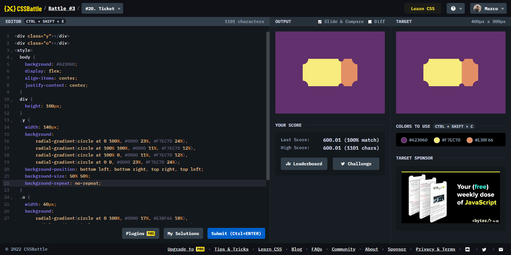

# Battle #3 - Cursor

## #20 - Ticket

[Link to the problem](https://cssbattle.dev/play/20)



```html
<div class="y"></div>
<div class="o"></div>
<style>
  body {
    background: #62306D;
    display: flex;
    align-items: center;
    justify-content: center;
  }
  div {
    height: 100px;
  }
  .y {
    width: 140px;
    background:
        radial-gradient(circle at 0 100%, #0000 23%, #F7EC7D 24%),
        radial-gradient(circle at 100% 100%, #0000 11%, #F7EC7D 12%),
        radial-gradient(circle at 100% 0, #0000 11%, #F7EC7D 12%),
        radial-gradient(circle at 0 0, #0000 23%, #F7EC7D 24%);
    background-position: bottom left, bottom right, top right, top left;
    background-size: 50% 50%;
    background-repeat: no-repeat;
  }
  .o {
    width: 60px;
    background:
        radial-gradient(circle at 0 100%, #0000 17%, #E38F66 18%),
        radial-gradient(circle at 100% 100%, #0000 34%, #E38F66 35%),
        radial-gradient(circle at 100% 0, #0000 34%, #E38F66 35%),
        radial-gradient(circle at 0 0, #0000 17%, #E38F66 18%);
    background-position: bottom left, bottom right, top right, top left;
    background-size: 50% 50%;
    background-repeat: no-repeat;
  }
</style>
```
