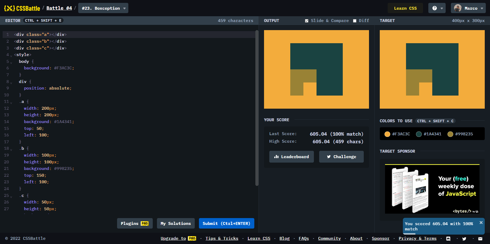

# Battle #4 - Display

## #23 - Boxception

[Link to the problem](https://cssbattle.dev/play/23)



```html
<div class="a"></div>
<div class="b"></div>
<div class="c"></div>
<style>
  body {
    background: #F3AC3C;
  }
  div {
    position: absolute;
  }
  .a {
    width: 200px;
    height: 200px;
    background: #1A4341;
    top: 50;
    left: 100;
  }
  .b {
    width: 100px;
    height: 100px;
    background: #998235;
    top: 150;
    left: 100;
  }
  .c {
    width: 50px;
    height: 50px;
    background: #F3AC3C;
    top: 200;
    left: 150;
  }
</style>
```
