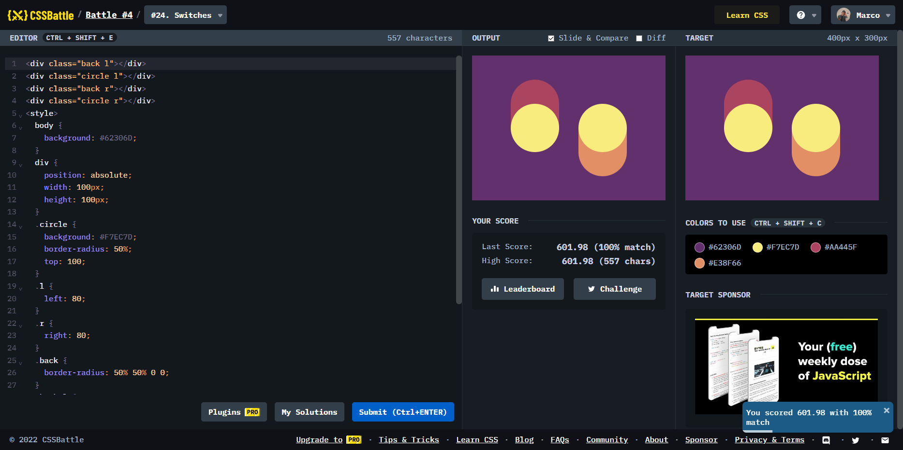

# Battle #4 - Display

## #24 - Switches

[Link to the problem](https://cssbattle.dev/play/24)



```html
<div class="back l"></div>
<div class="circle l"></div>
<div class="back r"></div>
<div class="circle r"></div>
<style>
  body {
    background: #62306D;
  }
  div {
    position: absolute;
    width: 100px;
    height: 100px;
  }
  .circle {
    background: #F7EC7D;
    border-radius: 50%;
    top: 100;
  }
  .l {
    left: 80;
  }
  .r {
    right: 80;
  }
  .back {
    border-radius: 50% 50% 0 0;
  }
  .back.l {
    background: #AA445F;
    top: 50;
  }
  .back.r {
    background: #E38F66;
    transform: rotate(180deg);
    bottom: 50;
  }
</style>
```
