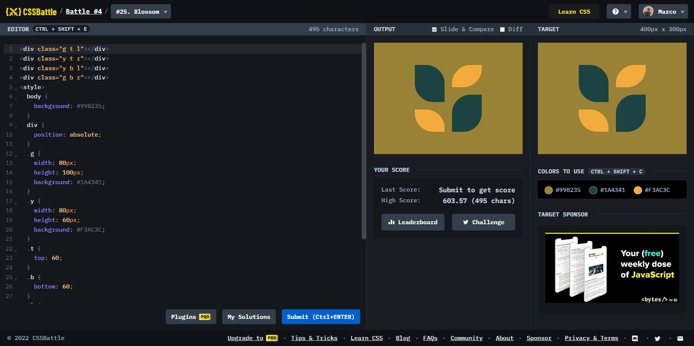

# Battle #4 - Display

## #25 - Blossom

[Link to the problem](https://cssbattle.dev/play/25)



```html
<div class="g t l"></div>
<div class="y t r"></div>
<div class="y b l"></div>
<div class="g b r"></div>
<style>
  body {
    background: #998235;
  }
  div {
    position: absolute;
  }
  .g {
    width: 80px;
    height: 100px;
    background: #1A4341;
  }
  .y {
    width: 80px;
    height: 60px;
    background: #F3AC3C;
  }
  .t {
    top: 60;
  }
  .b {
    bottom: 60;
  }
  .l {
    left: 110;
    border-radius: 0 50px;
  }
  .r {
    right: 110;
    border-radius: 50px 0;
  }
</style>
```
