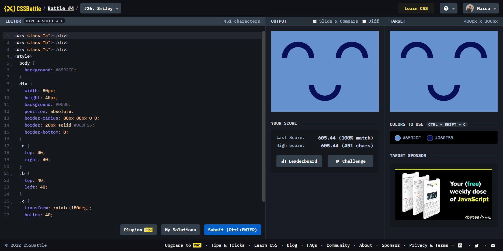

# Battle #4 - Display

## #26 - Smiley

[Link to the problem](https://cssbattle.dev/play/26)



```html
<div class="a"></div>
<div class="b"></div>
<div class="c"></div>
<style>
  body {
    background: #6592CF;
  }
  div {
    width: 80px;
    height: 40px;
    background: #0000;
    position: absolute;
    border-radius: 80px 80px 0 0;
    border: 20px solid #060F55;
    border-bottom: 0;
  }
  .a {
    top: 40;
    right: 40;
  }
  .b {
    top: 40;
    left: 40;
  }
  .c {
    transform: rotate(180deg);
    bottom: 40;
    left: 140
  }
</style>
```
