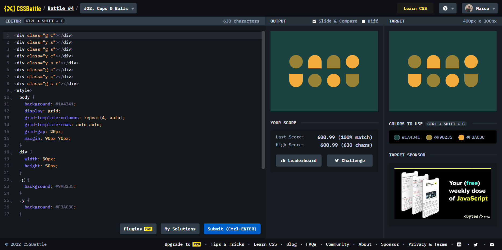

# Battle #4 - Display

## #28 - Cups & Balls

[Link to the problem](https://cssbattle.dev/play/28)



```html
<div class="g c"></div>
<div class="y s"></div>
<div class="g s"></div>
<div class="y c"></div>
<div class="y s r"></div>
<div class="g c"></div>
<div class="y c"></div>
<div class="g s r"></div>
<style>
  body {
    background: #1A4341;
    display: grid;
    grid-template-columns: repeat(4, auto);
    grid-template-rows: auto auto;
    grid-gap: 20px;
    margin: 90px 70px;
  }
  div {
    width: 50px;
    height: 50px;
  }
  .g {
    background: #998235;
  }
  .y {
    background: #F3AC3C;
  }
  .c {
    border-radius: 50%;
  }
  .s {
    border-radius: 50% 50% 0 0;
  }
  .r {
    transform: rotate(180deg);
  }
</style>
```
